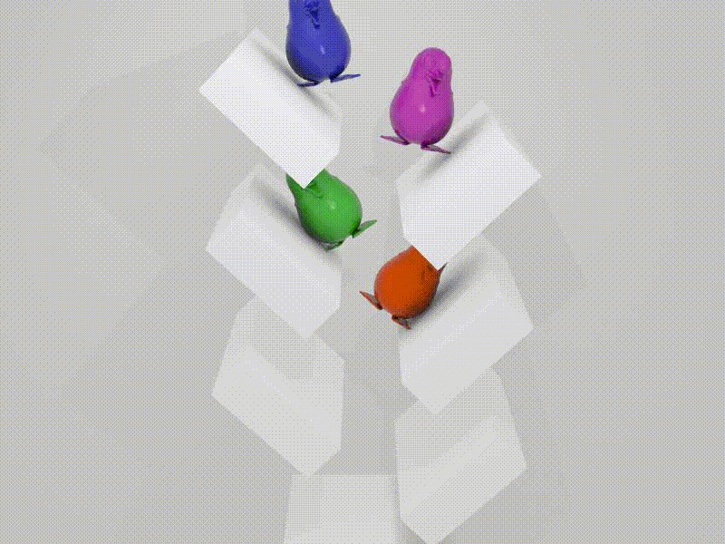

# Physics-based Animation __CSC2549 *Fall 2019*__

- [Lectures](#Lectures)
- [Course Overview](#course-overview)
- [Resources](#helpful-resources )
- [Lecture Schedule](#lecture-schedule)
- [Grading](#grading)
- [Lateness Policy](#lateness-policy)

## Instructors
Prof. [David I.W. Levin](http://www.cs.toronto.edu/~diwlevin/)  
diwlevin@cs.toronto.edu  
+1 416-978-2052  

Office Hours: Wednesdays 17:00-18:00 in BA5268

## TA  
Derek Liu
hsuehtil@cs.toronto.edu

## Lectures
Wednesdays 15:00-17:00 in Wilson Hall (WI 524) 

## Links

Bulletin Board using [Discourse](https://bb-2019-09.teach.cs.toronto.edu/c/csc2549)

Hand in assignments using [MarkUs](https://markus.teach.cs.toronto.edu/csc2549-2019-09/).

## Course Overview

This course is designed to introduce students to the field of physics-based animation by exposing  them to the underlying mathematical and algorithmic techniques required to understand and develop efficient numerical simulations of physical phenomena such as rigid bodies, deformable bodies and fluids. In Physics-Based Animation we will learn how to develop algorithms that produce visually compelling representations of physical systems.  We will learn the underlying continuous mathematics describing the motion of physical objects, explore how to discretize them and how to solve the resulting discrete equations quickly and robustly. 
  
**Prerequisites:** C/C++ Programming, Linear Algebra, Calculus, Numerical
Methods 

The student is expected to read background material as necessary and should be comfortable with elementary linear algebra, geometry,
and vector calculus. It is also assumed that the student is comfortable
programming in basic C++.

**_(Strongly)_ Recommended preparation:** Multivariable Calculus

## Helpful Resources  
[The Variational Principles of Mechanics (Book)](https://search.library.utoronto.ca/details?1576571&uuid=24e9601f-a561-440e-b4f7-0162225ae73d)  

[Numerical Methods for Evolutionary Differential Equations (Book) ](https://search.library.utoronto.ca/details?8723030)

[Fluid Simulation for Graphics (Book)](https://dl.acm.org/citation.cfm?id=1457699)   

[Real-time Collision Detection (Book)](https://dl.acm.org/citation.cfm?id=1121584)

[Real Time Physics (Website)](http://matthias-mueller-fischer.ch/realtimephysics/)  
  
[FEM Simulation of 3D Deformable Solids (Website)](http://www.femdefo.org)
  
## Lecture Schedule

| Week | Topic / Event |
| ---- | :------------ |
| 1    | [Introduction, the 1D mass-spring system](lectures/01-Intro-plain_edited-min.pdf), [Assignment 1 (1D mass-springs)](https://github.com/dilevin/CSC2549-a1-mass-spring-1d) due 27/09    
| 2    | [Explicit and implicit time integration](lectures/02-Time-Integration_edited.pdf)  
| 3    | Mass-spring systems in three dimensions, Assignment 2 (3D mass-springs) due 04/10  
| 4    | Finite Elements for simulating nonlinear elastodynamics of solids, Assignment 3 (3D FEM) due 11/10  
| 5    | Finite Elements for simulating cloth and shells, Assignment 4 (Cloth simulation) due 18/10  
| 6    | Fluid simulation using Finite Volume Methods  
| 7    | Rigid body mechanics, Assignment 5 (Rigid body simulation) due 01/11  
| **October 28** | Drop date (consider if grade so far is <50%)  
| 8    | Jointed Rigid Body Systems 
| 9    | Collision detection and contact resolution, Assignment 6 (Rigid body collision resolution) due 08/11  
| 10   | Fast algorithms for physics-based animation 
| 11   | Special Lecture 
| 12   | Final Project Presentations 

[Academic Honesty (required reading)](#academic-honesty)

## Grading

| % | Item |
| ----: | :-------------- |
| 60% | Assignments
| 10% | Class Participation 
| 30% | Final Project 

There will be six programming assignments in total (10% each).

## Lateness Policy

Assignments are **_due by 11:59pm_** on the due date.

0.007% off for every minute late.

### Academic Honesty

Academic honesty is a very serious matter and can result in very serious
consequences. Note that academic offences may be discovered and handled
retroactively, even after the semester in which the course was taken for credit.
This is a challenging class aimed at teaching you the fundamentals of computer
graphics. You wont learn much if you cheat but you might get a good grade if you
get away with it. If all you want is a good grade take an easier class where you
wont have to cheat!

For purposes of this class, academic dishonesty is defined as:

- Any attempt to pass off work on a test that didn't come straight out of your
  own head.
- Any collaboration on written or programming assignments (its ok to share ideas
  on programming assignments but the code MUST be your own) in which the
  collaborating parties don't clearly and prominently explain exactly who did
  what, at turn-in time.
- Any activity that has the effect of significantly impairing the ability of
  another student to learn. Examples here might include destroying the work of
  others, interfering with their access to resources (e.g., digital cameras), or
  deliberately providing them with misleading information.

### Email & Bulletin Board Traffic

- Please do not send email directly to the TAs. They will not be replied.
- Main forum for answering questions about class or about the assignments is the
  class bulletin board. The TAs will be monitoring the board.
- Appropriate use of the board: clarifications on assignment, on lecture
  material, general concerns about the course, or other remarks that are
  appropriate for all students to see/participate in.
- Do NOT broadcast pieces of your code or answers to written assignments to the
  bulletin board. Specific or general implementation questions whose answer
  would benefit all students in the class are appropriate. However: the bulletin
  board is NO replacement for the tutorial hour. That should be the main forum
  for asking/answering questions of this sort.
- Questions of the form "I cannot find the problem with my code; here it is, can
  you help me" are unlikely to be replied, so don't count on it. If you have a
  question with code, take it to the TA office hours or to the tutorials.
